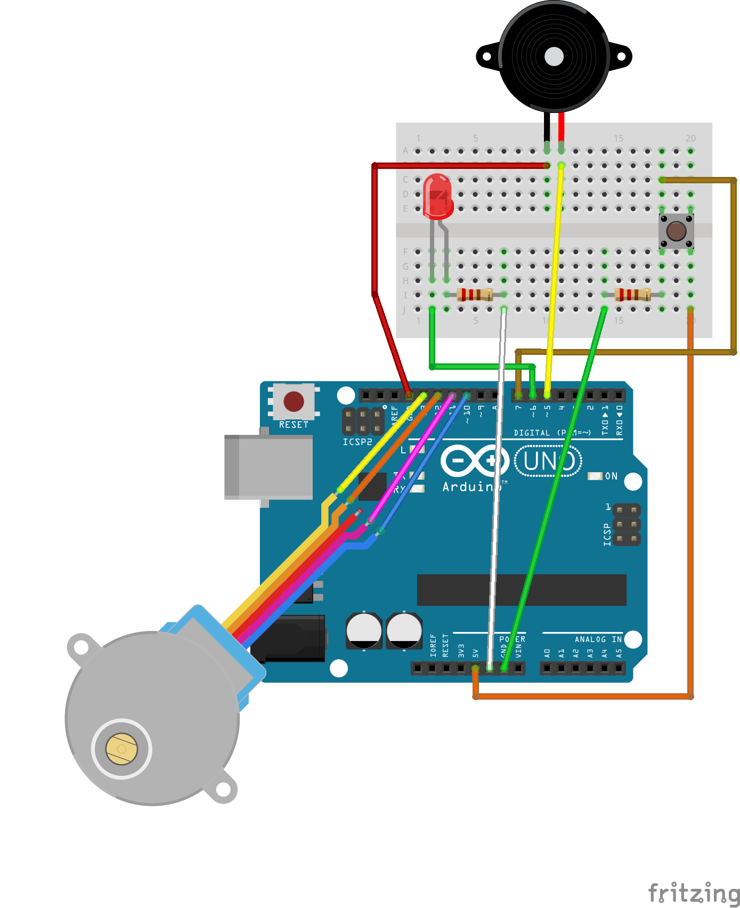

# ToyCraneArduino
Небольшой скетч для работы крана с игрушками из LEGO на платформе Arduino

## Из стартового набора Arduino вам понадобятся
- Плата Arduino UNO R3 или любая другая;
- Плата расширения для получения большего количества digital портов;
- Шаговый двигатель 28BYJ-48;
- Пьезоэлемент (зуммер) активный или пассивный;
- Светодиод;
- Тактовая кнопка.

## Видео со сборкой автомата

<!-- 

  

 -->

<iframe width="560" height="315" src="https://www.youtube.com/embed/SmAlhSyRT1Q" frameborder="0" allow="accelerometer; autoplay; encrypted-media; gyroscope; picture-in-picture" allowfullscreen></iframe>

## Схема подключения устройств к плате

  

